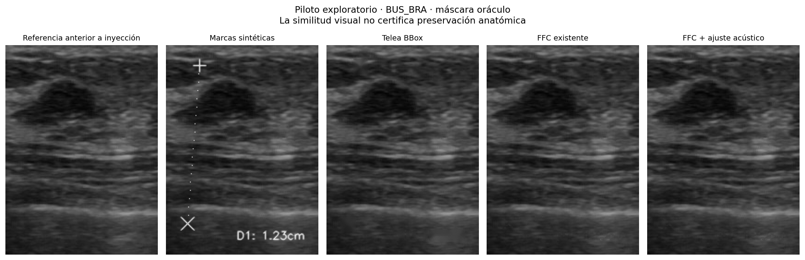

# Resultados V5 — piloto exploratorio, 12-09-2026

Se evaluaron cuatro referencias de la carpeta curada: dos BUS_BRA y dos BUSI según nombres de archivo. Sin verificación independiente de limpieza ni exclusión de solapamiento con entrenamiento. No es validación clínica. Semillas 42–45; resolución nativa; pesos existentes cargados estrictamente en CPU.

| Método | pPSNR dB ↑ | pSSIM ↑ | βσ | Sobel jump | Cambios fuera de marca sintética (píxeles/imagen) |
|---|---:|---:|---:|---:|---:|
| telea_bbox | 26.3012 | 0.7065 | 0.8774 | 11.6493 | 636.2500 |
| telea_stroke | 30.5503 | 0.8651 | 0.8038 | 13.1355 | 0.0000 |
| acoustic_telea | 30.2809 | 0.8571 | 0.8109 | 13.5442 | 0.0000 |
| ffc_finetuned | 31.9002 | 0.8914 | 0.8354 | 16.3293 | 0.0000 |
| ffc_acoustic | 31.6031 | 0.8826 | 0.8444 | 17.0490 | 0.0000 |
| detector_acoustic_telea | 9.9071 | 0.1111 | 0.8688 | 143.4869 | 169.7500 |
| selective_production | 7.8656 | 0.0459 | 0.3667 | 388.3263 | 0.0000 |

Medias aritméticas por imagen. pPSNR/pSSIM se evalúan en el soporte común GT del artefacto; βσ y Sobel sobre el soporte utilizado por cada método, por lo que los valores de BBox/detector no son comparaciones espaciales idénticas. El protocolo Sobel difiere de V4. No se informa intervalo clínico con solo cuatro imágenes de selección exploratoria.

## Interpretación

- FFC puro: 31,9002 dB, pSSIM 0,8914. FFC acústico: 31,6031 dB, 0,8826. El regularizador no supera FFC puro en este piloto; conservarlo como ablación, no presentarlo como mejora demostrada.
- La meta conjunta pPSNR>32 y pSSIM>0,92 no está alcanzada por FFC acústico en promedio.
- Todos los compositores sobre trazo conservaron exactamente el exterior de su propia máscara. Eso no implica pFPR=0 si la máscara es incorrecta.
- El detector experimental recuperó en promedio 15,65% del soporte antialiasado sintético; la restauración sin controles alteró 169,75 píxeles/imagen fuera de la marca inyectada. Este número no es pFPR tisular: no existe GT de tejido.
- El flujo selectivo se abstuvo en 4/4 casos sin soporte independiente: cobertura de edición aceptada 0%, cero alteraciones, marcas sin remover. La abstención evita daño, pero no satisface la remoción autónoma solicitada.
- pFPR clínico, Places2 original, LPIPS, ΔAUC, XAI clínico, PSF medida, preservación BI-RADS y lectura ciega: no evaluados.

## Evidencia y archivos

- [Métricas por imagen](../resultados/validacion_v5_multifuente/metrics.csv)
- [Auditoría con hashes y parámetros](../resultados/validacion_v5_multifuente/report.json)
- [Manifiesto BUS_BRA](../resultados/v5_manifiesto_bus_bra.json)
- [Abstención en muestra real](../resultados/v5_abstencion_sample1/audit.json)
- [Protocolo y tabla confirmatoria pendiente](PROTOCOLO_VALIDACION_V5.md)
- [Registro de 20 pruebas automatizadas aprobadas](../resultados/pruebas_v5.txt)
- [Lote real: 4 abstenciones, 1 sin candidatos, 0 errores](../resultados/v5_lote_auditado/summary.json)

El piloto inicial de tres imágenes en `validacion_v5_exploratoria` usaba otra colocación de marcas, parcialmente sobre fondo negro. Se conserva como registro de depuración y no se combina con el piloto principal.

## Qué falta para cumplir el objetivo científico

1. GT experto de trazos y tejido, negativos difíciles y un detector validado con sensibilidad y riesgo controlados.
2. Conjunto limpio por paciente realmente independiente y disponibilidad de UDIAT con metadatos.
3. Afinamiento FFC con pérdidas acústicas, comparación Places2 y ablaciones en particiones congeladas.
4. Entrenar/evaluar los tres brazos CAD, intervenciones contrafactuales, segmentación antes/después y lectura ciega real.
5. Calibrar umbrales por equipo, reportar intervalos por paciente y medir PSF/envolvente con información de adquisición adecuada.
