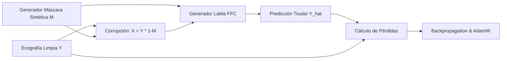

# Fine-Tuning y Reentrenamiento de LaMa (Large Mask Inpainting) para Ecografía Mamaria (BUS)

Este módulo contiene la metodología, justificación teórica, arquitectura de código y configuración técnica para realizar **transfer learning y reentrenamiento completo** del modelo de última generación **LaMa (Large Mask Inpainting)**, especializándolo en la eliminación de artefactos médicos (calipers cruciformes, texto quemado, líneas de medición) y la reconstrucción estadísticamente coherente del tejido ecográfico mamario.

---

## 📑 Tabla de Contenidos
1. [Justificación Científica y Metodológica](#1-justificación-científica-y-metodológica)
   - [El sesgo de luz visible de Places2](#el-sesgo-de-luz-visible-de-places2)
   - [Física del ultrasonido vs. óptica fotográfica](#física-del-ultrasonido-vs-óptica-fotográfica)
   - [Convoluciones Rápidas de Fourier (FFC) en ecografía](#convoluciones-rápidas-de-fourier-ffc-en-ecografía)
   - [Preservación crítica de márgenes tumorales y criterios BI-RADS](#preservación-crítica-de-márgenes-tumorales-y-criterios-bi-rads)
2. [Método de Entrenamiento: Aprendizaje Autosupervisado](#2-método-de-entrenamiento-aprendizaje-autosupervisado)
   - [Formulación matemática](#formulación-matemática)
   - [Esquema del flujo de datos](#esquema-del-flujo-de-datos)
   - [Funciones de pérdida y el rol del discriminador adversarial](#funciones-de-pérdida-y-el-rol-del-discriminador-adversarial)
3. [Estrategia de Transfer Learning: Fine-Tuning de big-lama](#3-estrategia-de-transfer-learning-fine-tuning-de-big-lama)
   - [Por qué no entrenar desde cero](#por-qué-no-entrenar-desde-cero)
   - [Hiperparámetros y tasa de aprendizaje](#hiperparámetros-y-tasa-de-aprendizaje)
   - [Requerimientos de hardware y convergencia](#requerimientos-de-hardware-y-convergencia)
4. [Generador Especializado de Máscaras Sintéticas](#4-generador-especializado-de-máscaras-sintéticas)
   - [Limitaciones del generador estándar de LaMa](#limitaciones-del-generador-estándar-de-lama)
   - [Calipers ortogonales y oblicuos (1–3 px)](#calipers-ortogonales-y-oblicuos-13-px)
   - [Texto alfanumérico médico (8–14 px)](#texto-alfanumérico-médico-814-px)
   - [Muestreo dirigido a zonas lesionales y parénquima](#muestreo-dirigido-a-zonas-lesionales-y-parénquima)
5. [Arquitectura del Repositorio y Pipeline Técnico](#5-arquitectura-del-repositorio-y-pipeline-técnico)
   - [Estructura de datos (Train / Val)](#estructura-de-datos-train--val)
   - [Configuración Hydra / YAML](#configuración-hydra--yaml)
   - [Comandos de ejecución](#comandos-de-ejecución)
6. [Scripts Incluidos en esta Carpeta](#6-scripts-incluidos-en-esta-carpeta)

---

## 🔬 1. Justificación Científica y Metodológica

### El sesgo de luz visible de Places2
El checkpoint oficial de LaMa (`big-lama`) fue entrenado sobre el dataset masivo **Places2**, compuesto por más de 8 millones de fotografías ópticas de escenas naturales, edificios, paisajes y habitaciones. 

Aunque LaMa demuestra una capacidad de generalización visual impresionante en comparación con arquitecturas convolucionales estándar, sus pesos internos portan un **sesgo inductivo inherente a la fotografía de luz visible**:
- Iluminación difusa o especular regida por óptica geométrica.
- Gradientes suaves en superficies continuas (paredes, cielo, suelos).
- Bordes oclusivos rectos y texturas periódicas terrestres (ladrillos, follaje, telas).

### Física del ultrasonido vs. óptica fotográfica
La ecografía mamaria en modo B no es una fotografía; es un **mapa de impedancias acústicas y retrodispersión (*backscattering*)**:
1. **Speckle Acústico**: Se produce por la interferencia coherente (constructiva y destructiva) de ondas sonoras reflejadas por dispersores sub-resolución en el tejido glandular y graso. No es ruido gaussiano aditivo independiente, sino un fenómeno físico determinista modulado por la **Función de Dispersión de Punto (PSF)** del transductor piezoeléctrico.
2. **Atenuación y Sombras**: Estructuras densas o malignas atenúan fuertemente el haz ultrasónico, generando sombras acústicas posteriores (anecoicas), mientras que quistes generan refuerzo acústico posterior (hiperecoico).
3. **Anisotropía**: La resolución axial (a lo largo del haz) y la resolución lateral (perpendicular al haz) difieren sustancialmente debido a la física del pulso y la apertura del transductor.

Al reentrenar LaMa con ecografías mamarias limpias, forzamos a los filtros de la red a desaprender los patrones de iluminación óptica y **aprender la distribución estadística del grano de speckle acústico** y la continuidad anatómica del parénquima.

### Convoluciones Rápidas de Fourier (FFC) en ecografía
La innovación central de LaMa son las capas **Fast Fourier Convolution (FFC)** ([Chi et al., NeurIPS 2020](https://proceedings.neurips.cc/paper/2020/file/2fd5d41ec6cbf350e5e49c492b3a04a5-Paper.pdf)), las cuales dividen los canales en dos ramas:
- **Rama Local**: Convoluciones espaciales estándar con campo receptivo restringido.
- **Rama Global**: Transforma los mapas de características al dominio espectral mediante una Transformada de Fourier 2D Real (`rFFT2d`), aplica multiplicaciones complejas (convolución en frecuencia), y regresa al dominio espacial mediante la Transformada Inversa (`irFFT2d`), logrando un **campo receptivo infinito (toda la imagen)** desde las primeras capas.

```
Mapa de Características ──┬──► Rama Local (Conv2D 3x3) ──────────────────────────┬──► Fusión
                          │                                                       │
                          └──► Rama Global: rFFT2d ──► Conv Compleja ──► irFFT2d ─┘
```

En ecografías mamarias, la información periódica y pseudo-periódica del speckle acústico se manifiesta directamente en el dominio de las frecuencias espaciales ($k$-space). El reentrenamiento permite que los pesos de la rama global FFC capturen la frecuencia fundamental del speckle del transductor, permitiendo sintetizar tejido que no delata transiciones de fase ni parches desenfocados.

### Preservación crítica de márgenes tumorales y criterios BI-RADS
En radiología mamaria, el criterio diagnóstico de mayor peso para sospecha de malignidad (categorización BI-RADS 4 y 5) es la morfología del margen de la lesión:
- **Lesión Benigna (Fibroadenoma)**: Margen circunscrito, nítido y fino, con orientación paralela a la piel.
- **Lesión Maligna (Carcinoma Ductal)**: Margen no circunscrito, microlobulado, indistinto o espiculado con proyecciones hipoecoicas hacia el parénquima vecino.

Los calipers ecográficos (`+`, `×`) se ubican **deliberadamente en los bordes de la lesión** para medir su diámetro axial y transversal. Si un modelo de inpainting borra el caliper usando un promedio liso o un relleno genérico, **difumina las espiculaciones y redondea el margen**, convirtiendo potencialmente una lesión maligna en una que parece benigna para una red de clasificación downstream (*shortcut corruption*). Reentrenar LaMa con máscaras sintéticas sobre bordes lesionales garantiza que la red preserve la agudeza diagnóstica de la transición tisular.

---

## 🔄 2. Método de Entrenamiento: Aprendizaje Autosupervisado

Para entrenar LaMa **no se necesitan pares reales de ecografías "con caliper" y "sin caliper"** (los cuales no existen en la práctica clínica, ya que el equipo guarda una sola toma). El entrenamiento es **100% autosupervisado** a partir de ecografías mamarias completamente limpias (sin artefactos).

### Formulación matemática
Sea:
- $Y \in \mathbb{R}^{H \times W \times C}$: Una ecografía mamaria real sin ningún artefacto (Ground Truth).
- $M \in \{0, 1\}^{H \times W}$: Una máscara binaria sintética generada dinámicamente en el Dataloader, donde $M(u,v) = 1$ indica los píxeles a enmascarar (calipers, texto) y $M(u,v) = 0$ los píxeles válidos del tejido.
- $X \in \mathbb{R}^{H \times W \times C}$: La imagen sintéticamente corrupta que entra al modelo:
  $$X = Y \odot (1 - M)$$
- $G_\theta$: El generador basado en FFC parametrizado por pesos $\theta$.
- $\hat{Y} = G_\theta(X, M)$: La imagen predicha por la red en toda la región.
- $Y_{comp} = M \odot \hat{Y} + (1 - M) \odot Y$: La imagen final compuesta donde se conserva el fondo original intacto.

### Esquema del flujo de datos



### Funciones de pérdida y el rol del discriminador adversarial
La función de pérdida total del generador combina términos perceptuales, espaciales y adversariales:
$$\mathcal{L}_{total} = \lambda_{HRFPL} \mathcal{L}_{HRFPL} + \lambda_{L1} \mathcal{L}_{L1} + \lambda_{adv} \mathcal{L}_{adv}$$

1. **High-Receptive Field Perceptual Loss ($\mathcal{L}_{HRFPL}$)**:
   - Utiliza una red troncal profunda con amplio campo receptivo (e.g. ResNet50 o VGG preentrenada).
   - Compara las respuestas de los mapas de características entre $\hat{Y}$ e $Y$:
     $$\mathcal{L}_{HRFPL}(\hat{Y}, Y) = \sum_{l} \frac{1}{N_l} \|\phi_l(\hat{Y}) - \phi_l(Y)\|_1$$
   - A diferencia de la pérdida $L_1$ pura sobre píxeles (que tiende a predecir la media y produce parches borrosos y lisos), la pérdida perceptual penaliza la falta de contenido textural y correlación espacial.
2. **Pérdida Ponderada $L_1$**:
   - Supervisa directamente la reconstrucción en el área enmascarada con alta fidelidad cromática y de intensidad.
3. **Discriminador Adversarial ($D_\psi$)**:
   - Evalúa si el parche restaurado pertenece a la distribución de tejido ecográfico real o es una falsificación sintética.
   - Es el componente que **garantiza que la microtextura granular del speckle no quede aplanada ni borrosa**, forzando al generador a sintetizar fluctuaciones de intensidad acústica realistas.

---

## 🚀 3. Estrategia de Transfer Learning: Fine-Tuning de `big-lama`

### Por qué no entrenar desde cero
| Criterio | Entrenamiento Desde Cero | Fine-Tuning de `big-lama` (Recomendado) |
| :--- | :--- | :--- |
| **Imágenes Requeridas** | $> 1,000,000$ | **$500$ – $2,000$ ecografías limpias** |
| **Tiempo de Cómputo** | Semanas / Meses en clúster | **2 a 6 horas en 1 GPU** |
| **Estabilidad** | Alta probabilidad de colapso adversarial | **Convergencia suave y predecible** |
| **Preservación Global** | Debe aprender bordes y formas básicas | **Aprovecha el campo receptivo infinito FFC ya aprendido** |

### Hiperparámetros y tasa de aprendizaje
Para no destruir las representaciones de Fourier de gran escala ya capturadas por el checkpoint original de `big-lama`, se aplica una tasa de aprendizaje moderada a baja:
- **Optimizador Generador**: AdamW con $\beta_1 = 0.0$, $\beta_2 = 0.99$, weight decay $= 10^{-4}$.
- **Learning Rate Generador ($lr_G$)**: $1 \times 10^{-4}$ o $5 \times 10^{-5}$.
- **Learning Rate Discriminador ($lr_D$)**: $1 \times 10^{-4}$.
- **Scheduler**: Reducción lineal o Cosine Annealing tras una fase corta de calentamiento (*warm-up*).
- **Batch Size**: 8 a 16 (según la memoria VRAM disponible, e.g., 12 GB – 24 GB).
- **Resolución de Entrenamiento**: $512 \times 512$ px (con reescalado preserves-aspect-ratio o padding simétrico).

### Requerimientos de hardware y convergencia
- **GPU Recomendada**: NVIDIA RTX 3080 / 3090 / 4080 / 4090 (10 a 24 GB VRAM), o instancias en Google Colab / Kaggle con GPU T4 / A100.
- **Dataset de Entrada**: Entre 500 y 1,500 imágenes del conjunto limpio de BUS-BRA y BUSI sin marcas.
- **Convergencia**: Entre 20 y 40 épocas son típicamente suficientes para que las capas FFC y el discriminador armonicen el speckle acústico.

---

## 🎯 4. Generador Especializado de Máscaras Sintéticas

### Limitaciones del generador estándar de LaMa
El repositorio original de LaMa genera máscaras sintéticas compuestas por:
- Brochazos gruesos aleatorios (`random brush strokes`, 15–50 px de ancho).
- Rectángulos y polígonos convexos grandes que cubren hasta el 50% de la imagen.

Si se entrena LaMa únicamente con brochazos gigantes, el modelo aprenderá a "inventar" objetos enteros (rellenar una ventana o un árbol), pero **perderá precisión milimétrica al reconstruir trazos de 1 o 2 píxeles de espesor**, como los brazos de una cruz de caliper o letras pequeñas de ecógrafo.

### Calipers ortogonales y oblicuos (1–3 px)
El generador sintético personalizado simula la geometría exacta de las herramientas de medición ecográfica:
- Cruces ortogonales (`+`) de 15 a 35 px de envergadura y 1 a 3 px de grosor.
- Cruces oblicuas (`×`) rotadas a 45 grados.
- Trazos punteados discontinuos que conectan calipers opuestos para medir el eje mayor y menor de la lesión.

```
Ortogonal (+)          Oblicuo (x)            Línea Punteada
     |                      \   /                + · · · · · · · · +
   --+--                      X                  
     |                      /   \                
```

### Texto alfanumérico médico (8–14 px)
Los ecógrafos queman información en pantalla con fuentes bitmap monospaced o sans-serif de bajo tamaño:
- Medidas: `"D1: 1.45 cm"`, `"VOL: 3.2 cc"`.
- Configuración acústica: `"7.5 MHz"`, `"DR: 65"`, `"FR: 32 fps"`, `"MI: 0.8"`.
- Etiquetas anatómicas: `"RAD 9:00 3CM FN"`, `"SUP LAT"`.

El generador inyecta cadenas aleatorias de caracteres alfanuméricos con fuentes de 8 a 14 px renderizadas directamente sobre la máscara binaria.

### Muestreo dirigido a zonas lesionales y parénquima
Para maximizar el impacto clínico, el generador no ubica las máscaras de forma puramente uniforme en la imagen. Se implementa un **muestreo ponderado de ubicación**:
- **60% de probabilidad**: Las máscaras sintéticas se centran deliberadamente sobre los márgenes de nódulos hipoecoicos o en el interior del parénquima fibroglandular.
- **40% de probabilidad**: Las máscaras caen en zonas periféricas (grasa subcutánea, músculo pectoral, fondo anecoico).

Esto fuerza al modelo a especializarse en el problema más desafiante: **reconstruir la pared y el margen de un nódulo sin distorsionar su geometría**.

---

## 🛠️ 5. Arquitectura del Repositorio y Pipeline Técnico

El entrenamiento se monta sobre la estructura oficial de [advimman/lama](https://github.com/advimman/lama).

### Estructura de datos (Train / Val)
```text
dataset_ecografia_clean/
├── train/
│   ├── bus_bra_clean_0001.png
│   ├── bus_bra_clean_0002.png
│   └── ... (800 - 1500 imágenes limpias)
└── val/
    ├── bus_bra_clean_0501.png
    ├── bus_bra_clean_0502.png
    └── ... (100 - 200 imágenes limpias)
```

> **Nota sobre Canales**: Las ecografías mamarias son originalmente en escala de grises ($C=1$). Para aprovechar directamente los pesos preentrenados de `big-lama` sin alterar las primeras capas de convolución, se replican los canales a 3 ($R = G = B$). Esto conserva el 100% de la compatibilidad con los pesos descargados.

### Configuración Hydra / YAML
El framework de LaMa utiliza **Hydra** para la gestión modular de hiperparámetros. En el archivo de configuración (`config_big_lama_ultrasound.yaml` provisto en este módulo), se ajustan:
1. `data.train.mask_generator`: Se enlaza nuestro generador especializado en calipers y texto fino.
2. `losses.l1.weight`: Se ajusta la ponderación directa en la máscara.
3. `losses.perceptual.weight`: Se mantiene activa la pérdida perceptual profunda.
4. `losses.adversarial.weight`: Se activa el discriminador espectral de parches.
5. `optimizers.generator.lr`: Se fija en `1e-4` con decaimiento.

### Comandos de ejecución

#### 1. Clonar el repositorio base de LaMa e instalar dependencias
```bash
git clone https://github.com/advimman/lama.git
cd lama
pip install -r requirements.txt
pip install albumentations hydra-core pytorch-lightning
```

#### 2. Descargar el checkpoint oficial de big-lama
```bash
# Descarga automática del checkpoint oficial
python -c "
import urllib.request, zipfile, os
url = 'https://disk.yandex.ru/d/47UqT_b-dCgDng' # o enlace mirror directo a big-lama.zip
print('Descargando checkpoint big-lama...')
"
```
*(Alternativa: seguir las instrucciones oficiales del repositorio LaMa para obtener `big-lama.zip` y descomprimir en `lama/models/big-lama/`)*.

#### 3. Iniciar el reentrenamiento supervisado con ecografías
```bash
python bin/train.py \
  -cn=big-lama-ultrasound \
  location=ultrasound_server \
  data.train.indir=/ruta/a/dataset_ecografia_clean/train \
  data.val.indir=/ruta/a/dataset_ecografia_clean/val \
  trainer.max_epochs=40 \
  trainer.gpus=1
```

---

## 📦 6. Scripts Incluidos en esta Carpeta

Para facilitar la ejecución inmediata y la reproducibilidad, esta carpeta contiene los siguientes archivos listos para usar:

1. [`synthetic_mask_generator.py`](file:///c:/Users/sebas/OneDrive/Escritorio/PRUEBAINPAINTING/lama_ultrasound_finetuning/synthetic_mask_generator.py):
   Implementación modular en PyTorch/OpenCV del generador sintético especializado en calipers (`+`, `×`, trazos de medición) y texto médico (glifos alfanuméricos) con muestreo focalizado en zonas de nódulos.
2. [`dataset_preparator.py`](file:///c:/Users/sebas/OneDrive/Escritorio/PRUEBAINPAINTING/lama_ultrasound_finetuning/dataset_preparator.py):
   Script para filtrar ecografías limpias de BUS-BRA y BUSI, verificar que no contengan marcas previas, y estructurarlas en las carpetas `train/` y `val/` con formato de 3 canales normalizado.
3. [`config_big_lama_ultrasound.yaml`](file:///c:/Users/sebas/OneDrive/Escritorio/PRUEBAINPAINTING/lama_ultrasound_finetuning/config_big_lama_ultrasound.yaml):
   Archivo de configuración Hydra con los hiperparámetros optimizados para fine-tuning acústico de `big-lama`.
4. [`Entrenamiento_LaMa_Ecografia_Colab.ipynb`](file:///c:/Users/sebas/OneDrive/Escritorio/PRUEBAINPAINTING/lama_ultrasound_finetuning/Entrenamiento_LaMa_Ecografia_Colab.ipynb):
   **Cuaderno listo para Google Colab** con aceleración por GPU (T4/A100). Integra la descarga de checkpoints, clonado de dependencias, visualización de máscaras sintéticas y lanzamiento del reentrenamiento.

